  

  
  
  

# API-to-Readme-WoW ⚔️

*A portfolio piece demonstrating automated data pipelines, REST API consumption, and CI/CD workflows.*

Welcome to my **CodeNode-Automation** repository! This project serves as a practical demonstration of backend automation. It uses Python to securely query the Blizzard Battle.net APIs, process deeply nested JSON data, and dynamically generate visual dashboards (SVG & HTML) that automatically update this repository every single day.

---

## 🌐 Live Interactive Web Dashboard
**Check out the live frontend deployment:** [https://CodeNode-Automation.github.io/API-to-Readme-WoW/](https://CodeNode-Automation.github.io/API-to-Readme-WoW/)  

*The live site features fully interactive, authentic in-game gear tooltips powered by Wowhead's JavaScript API, bypassing GitHub's README security constraints.*

---

## 🛠️ Technical Stack & Skills Demonstrated
- **Python 3:** Core scripting, data transformation, and programmatic file generation.
- **REST API Consumption:** Managing secure OAuth2 client credentials and aggregating data across multiple endpoints (Profile, Equipment, Statistics, and Media).
- **JSON Data Handling:** Navigating complex nested dictionaries, implementing safe `.get()` fallbacks for missing data (handling 404s gracefully), and routing localization data.
- **CI/CD Automation (GitHub Actions):** Building a serverless cron job that provisions an Ubuntu runner, installs dependencies, executes the pipeline, and commits changes without human intervention.
- **Dynamic Asset Generation:** Bypassing GitHub's strict Content Security Policy (CSP) by downloading external images on the fly, encoding them as Base64 strings, and injecting them into a dynamically drawn SVG file.
- **Static Site Generation:** Using Python to programmatically write and deploy a multi-character `index.html` frontend.

## ⚙️ The Automation Pipeline
1. **Trigger:** A GitHub Actions workflow (`update_data.yml`) wakes up automatically via a cron schedule.
2. **Authenticate:** The runner securely passes credentials from GitHub Secrets to generate an OAuth2 access token.
3. **Fetch & Parse:** Python requests live character data, parsing the JSON payloads to extract core stats and equipment.
4. **Encode:** Python makes secondary calls to the Media API, downloading item icons and converting the JPEGs into Base64 strings.
5. **Render:** Unique SVG files for each character are programmatically redrawn with the fresh data and saved to the `/asset` folder.
6. **Web Build:** Python generates an `index.html` dashboard mapping all character IDs to Wowhead tooltip endpoints.
7. **Deploy:** The Git bot checks for data changes and commits the updated SVGs and HTML back to the `main` branch, automatically triggering a GitHub Pages deployment.

---

## 📊 Live Character Dashboard (SVG Fallbacks)
*These graphics are generated and updated entirely by the Python pipeline.*

---

## 🚀 Future Roadmap & Dev Insights
- [x] Expand the repository to include a static HTML/CSS dashboard hosted on GitHub Pages.
- [ ] Add robust exception handling for Blizzard server maintenance downtime (503 errors).
- [ ] Incorporate character achievements or reputation endpoints into the HTML dashboard.
- [ ] Track historical gear upgrades over time using a lightweight data store (SQLite/JSON).
- [ ] Refactor API calls to run asynchronously using `aiohttp` to reduce GitHub Actions runner time.